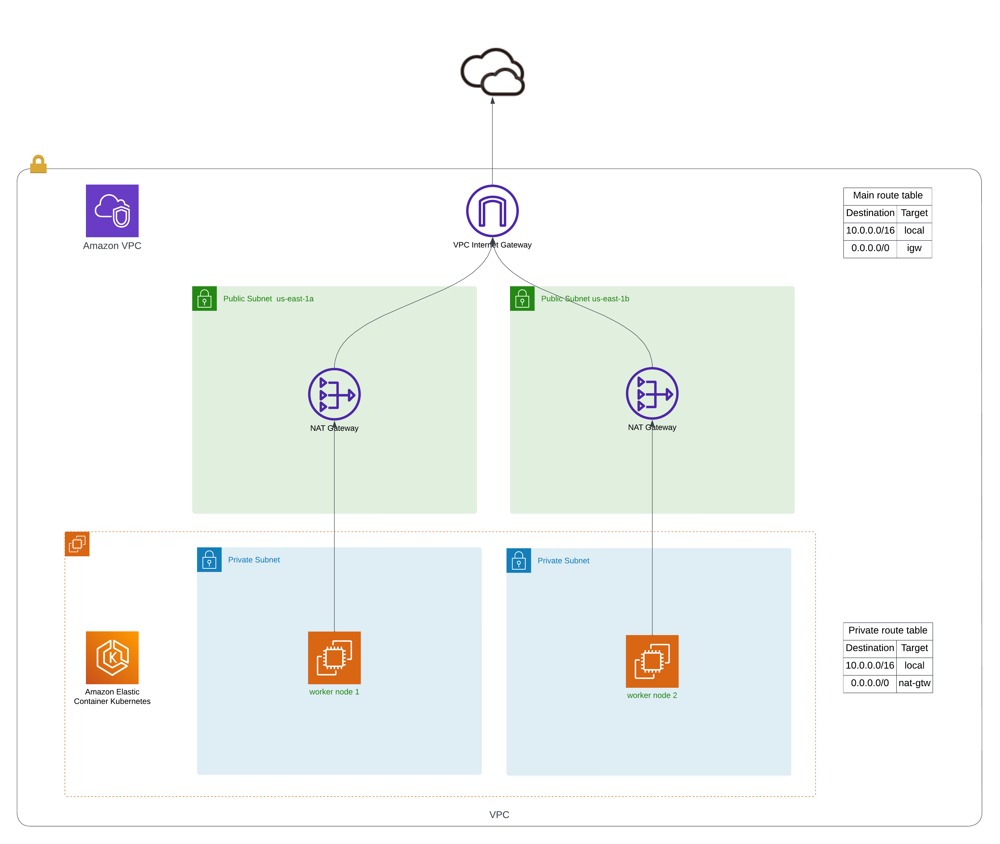

# Conquer Project

- [Conquer Project](#conquer-project)
  - [Overview](#overview)
    - [Links](#links)
    - [Branch strategy](#branch-strategy)
      - [Release flow](#release-flow)
    - [Infrastructure](#infrastructure)
      - [Create new bucket for terraform state](#create-new-bucket-for-terraform-state)
      - [Github Actions Workflow](#github-actions-workflow)
        - [Create and destroy ephemeral resources](#create-and-destroy-ephemeral-resources)
        - [Schedule](#schedule)
        - [Pull request decorate](#pull-request-decorate)
      - [Local terraform](#local-terraform)
    - [EKS](#eks)
      - [Connecting to the cluster](#connecting-to-the-cluster)


## Overview

Welcome to the Conquer Project! In this collaborative effort, three enthusiastic colleagues come together to tackle the challenge of creating a project end to end using AWS, Harborm, Helm, Kubernetes, Kafka, Terraform and golang

### Links

- conquerproject.io
- conquerproject.io/argocd

### Branch strategy

#### Release flow

- Base branch: `main`
- Feature branch: `feature/*`
- Fix branch: `fix/*`
- Chore branch: `chore/*`

1. For a new feature:
- Create a new branch from `main` to `feature/<feature-name>` `git checkout -b feature/<feature-name>`
- Once the feature is complete and tested, a new PR should be created to merge back to `main` `gh pr create`

2. For bug fix:
- Create a new branch from `main` to `fix/<fix-name>` `git checkout -b fix/<fix-name>`
- After the fix is implemented and tested, a new PR should be created to merge back to `main` `gh pr create`

3. For chore:
- Create a new branch from `main` to `chore/<chore-name>` `git checkout -b chore/<chore-name>`
- After the chore is implemented and tested, a new PR should be created to merge back to `main` `gh pr create`

Terrible representation
```
feat/specific-feature-name------\
                                   \
                                    \
                                     \
main --------------------------------\
                                     /
                                    /
                                   /
fix/specific-fix-name---------------/

```

### Infrastructure



#### Create new bucket for terraform state
```bash
aws s3api create-bucket --region us-east-1 --bucket conquer-project-tf-state --acl private
```

#### Github Actions Workflow

This repository contains workflows to create, destroy, plan and decorate a pull request using terraform infrastructure plan/apply.

##### Create and destroy ephemeral resources

The `create-ephemeral-resources.yml` workflow perform a terraform plan and apply of the resources within `infrastructure/ephemeral-resources` as well as give administrator permission to the EKS cluster and deploy ArgoCD and its Apps.

The `destroy-ephemeral-resources.yml` workflow destroy all resources within `infrastructure/ephemeral-resources` to all terraform workspaces

##### Schedule

The schedule configuration within `create-ephemeral-resources.yml`  workflow will create all resources inside `infrastructure/ephemeral-resources` in the defined time. Also the destroy schedule configuration within `destroy-ephemeral-resources.yml` workflow will delete all resources inside `infrastructure/ephemeral-resources` in the defined time.

##### Pull request decorate

Pull requests are decorated with terraform plan thorugh the reusable workflow `terraform.yml` when a new pull request is open to `infrastructure/*`


#### Local terraform

To plan apply using locally terraform follow the basic terraform workflow, example:

```bash
# For any modification, always format
terraform fmt

# Init
terraform init

# Validate the code
terraform validate

# Select the desired workspace
terraform workspace select <environment> # dev, staging, prod

# Plan
terraform plan -out plan.out # TBD, in order to differ environments --var-file=<env>.tfvars. Is there a way we can use terraform.workspace to do more complex logic ?

# Apply
terraform apply plan.out # TBD, --var-file=<env>.tfvars
```

### EKS

#### Connecting to the cluster

Configuring kubernetes context
```bash
aws eks update-kubeconfig --name "<env>-conquer-cluster"
```

To test connection `kubectl get svc`